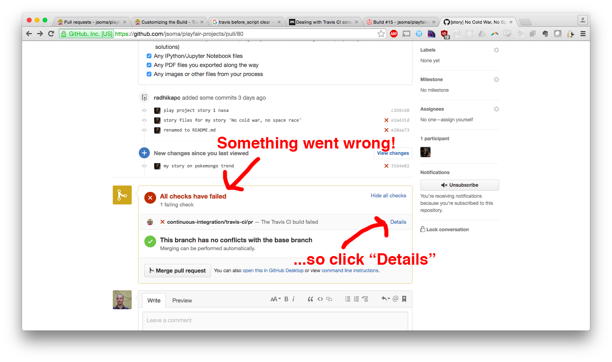
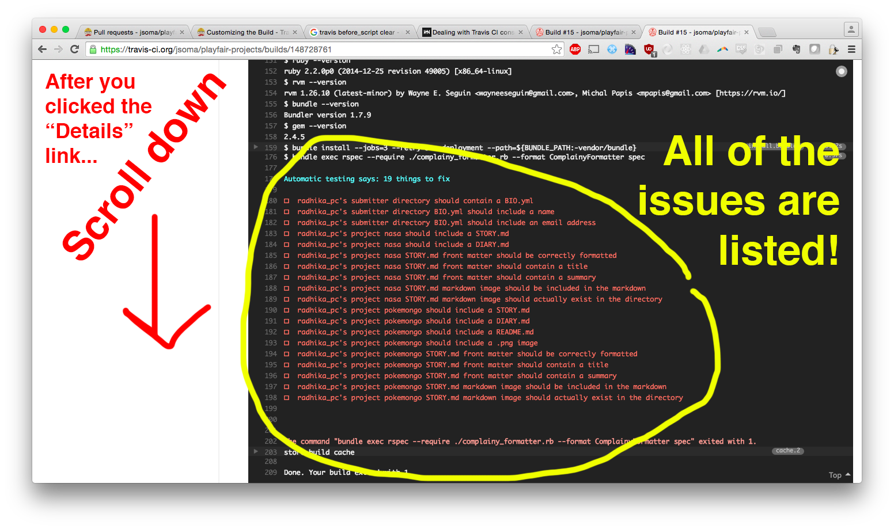

# Pull request checklist

### How the checklist works

After you submit a pull request, **cut and paste the following into your pull request** (but be sure to fill in the story title, pitch issue and story issue links before you save).

After the pull request has been submitted, you'll be able to use the checkboxes interactively. When all the boxes are checked, we'll be able to accept your pull request.

[See an example user folder + project folder + appropriate files](https://github.com/jsoma/playfair-projects/tree/master/examples)

### The Checklist

    # Pull Request Checklist
    
    Story title: _

    My pitch issue is (use the number): _

    My story issue is (use the number): _
    
    ### Story Issues

    - [ ] My pitch issue checklist is complete
    - [ ] My story issue checklist is complete

    ### Directory Format

    - [ ] There is a folder in `/projects/` that is my full name
    - [ ] I have included a BIO.yml in the folder named after me that includes name and contact information (see examples)
    - [ ] Inside of that folder I have another folder just for this project

    ### Visualization

    - [ ] My visualization has a title on it
    - [ ] I have cited by data source on the visualization
    - [ ] My visualization has my name/web site/twitter handle on it (only needs **one**)
    - [ ] I have exported my visualization as a `png` file

    ### STORY.md

    - [ ] I have included a `STORY.md`
    - [ ] I have included a front matter section with the a title and summary
    - [ ] I have properly linked my image, with a format like ``
    - [ ] If necessary, I have written text and such

    ### Other files to include

    - [ ] `README.md`, linking to my data set (if possible) and giving a brief overview of how I accomplished my task
    - [ ] `DIARY.md`, the notes you were keeping for yourself while working on the projects (problems, solutions) 
    - [ ] Any IPython/Jupyter Notebook files
    - [ ] Any PDF files you exported along the way
    - [ ] Any images or other files from your process

### Automated Testing

Some of these things are really boring to make people look for, so we set up an automated system using a tool called Travis to help you double-check your work!

When you submit a pull request, it will automatically be run against a suite of tests using Travis. If there's something you ned to fix before we can accept your pull request, you'll see something about **checks failing**. To find out details, click... **Details!**

The page you land on after you click **Details** is a little ugly, but I reworked it so you end up with nice little todo list at the bottom. Scroll down, take a look, and you'll see exactly what you need to fix.

In this pull request, for example, we have a few files that are the wrong name/capitalization and maybe some that are missing. There are also two stories being pushed - `nasa` and `pokemongo` - which means both stories have to be at 100% before we'll be able to accept the request! It's usually best to keep it to one story per pull request, so don't commit your second story's files before the first story is done.
