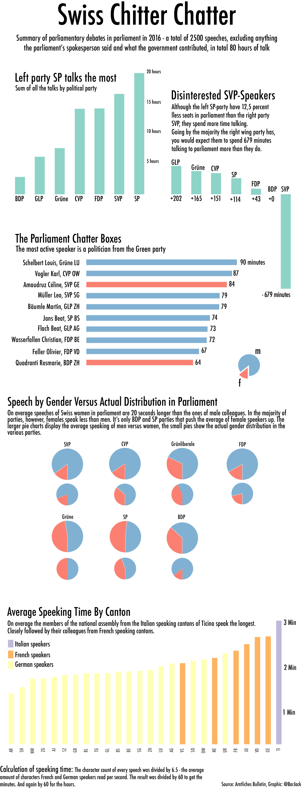

It's not the French doing all the talking, but the Italian Swiss. At least
when it comes to average speeking time. Swiss parliamentary services publishes
1000 page PDFs of the debates in Parliament after every session. I've taken
all the PDFs of 2016, created a dictionary and established who talks the longest.
Then do the same for cantons, women, men, political parties, etc.
