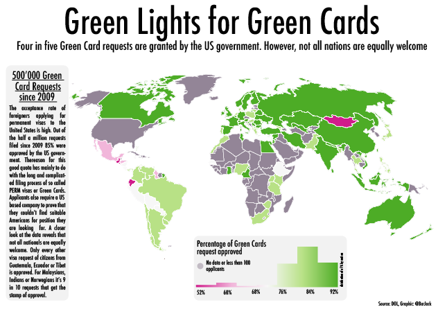
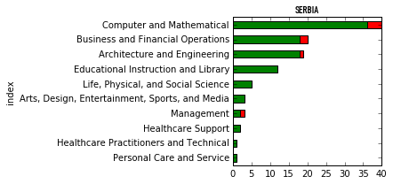
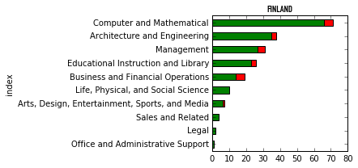
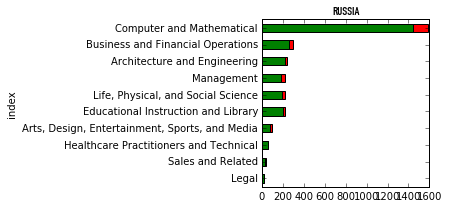

This map shows the acceptance rate of Green Card's issued to applying nations
where the number of applications was higher than 100. It is, however, not quite
fair to compare nations. To compare applicants from different nations in the
same wage bracket and in the same professions, I developed a predictor.

- Scikitlearn and RandomForestClassifier
- Heroku
- Pickle and a SQL Dump. This last step I am working on.

### Professions and acceptance rates of top and bottom countries

