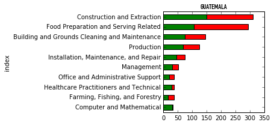

--
title: "Green Lights for Green Cards"

summary: "85% of Green Card applications to the US are accepted. This high rate
is due to the fact that getting as far as the official application requires a
lot of paper work and legal hurdles in itself. And most importantly, it requires
you have a company offering you a job, who is able to prove they could not find
any suitable employee in the US. However, not all nations are equally welcome.
---

This map shows the acceptance rate of Green Card's issued to applying nations
where the number of applications was higher than 100. It is, however, not quite
fair to compare nations. To compare applicants from different nations in the
same wage bracket and in the same professions, I developed a predictor.

- Scikitlearn and RandomForestClassifier
- Heroku
- Pickle and a SQL Dump. This last step I am working on.

### Professions and acceptance rates of top and bottom countries

