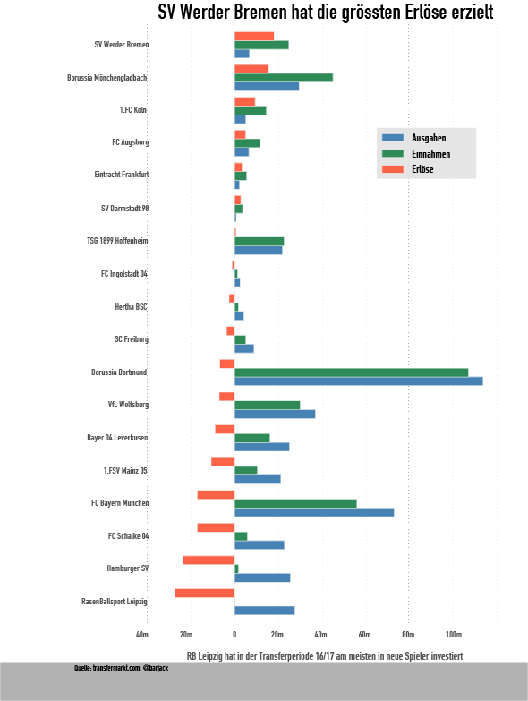
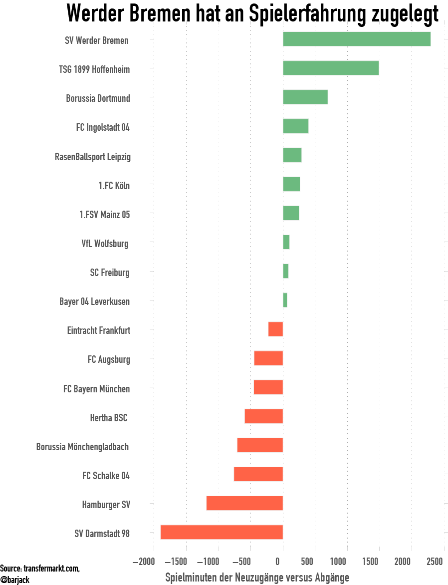
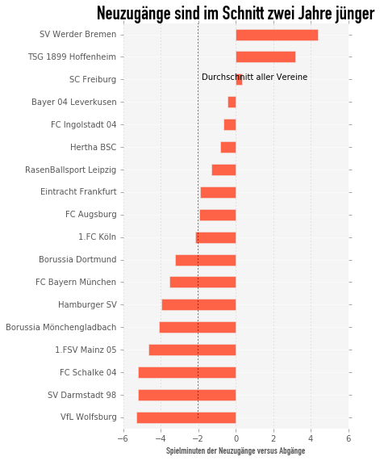

#Title:
Borussia Dortmund Dominated Transfers This Summer

#Summary:
You would expect the serial Champions Bayern Munich to be the top
buyer and seller of footballers in the league. And most years it usually is.
This time round last year's runners up have bought players for nearly 110m Euros
and sold players for even more: nearly 120m Euros.

This automated scraper of the football data site doesn't just compare turnover
of players, but also how team have changed during the summer transfer period.
How new signing compare to players leaving the club in height, goal scoring
records, experience. And last but not least, how which shoes are the most
successful when it comes to scoring goals.
------------

------------
