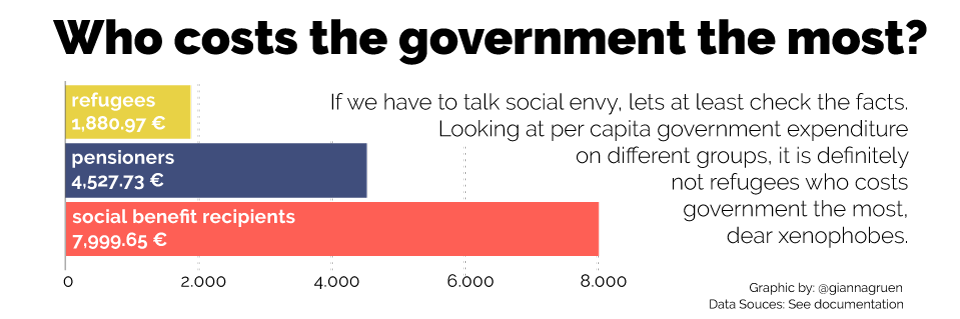

"There's lots of money for refugees, but only few for pensioners and families." is one of the arguments of xenophobic people in Germany.

Let's just look at the facts -- how much does the German government spend per refugee, pensioner and social benefit recipient?

And even in international comparison, Germany doesn't really spend more than other countries on supporting refugees. We could take Sweden as a role model!

In fact, several studies have shown that the money invested in refugees is anything but wasted: it pays off in many ways. After investing in refugees, they will integrate and push economy in the long run.

In Germany, refugees will help to set a counter balance to the ageing population: As mostly young people they have a long working life ahead and thereby decrease the negative effects of the demographic change on the economy, the [Economist](http://www.economist.com/news/finance-and-economics/21688938-europes-new-arrivals-will-probably-dent-public-finances-not-wages-good-or) reports.

And the [Brookings Institute](https://www.brookings.edu/2015/09/16/much-ado-about-nothing-the-economic-impact-of-refugee-invasions/) points out how the economies of Lebanon, Jordan, and Turkey have been growing due to refugee inflow.
