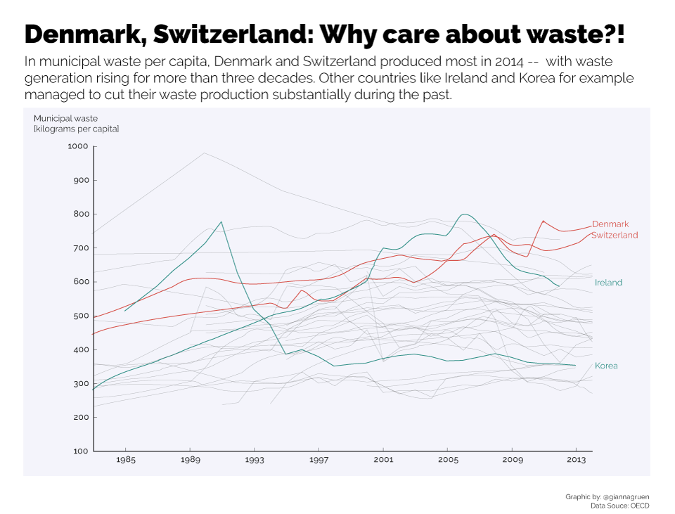
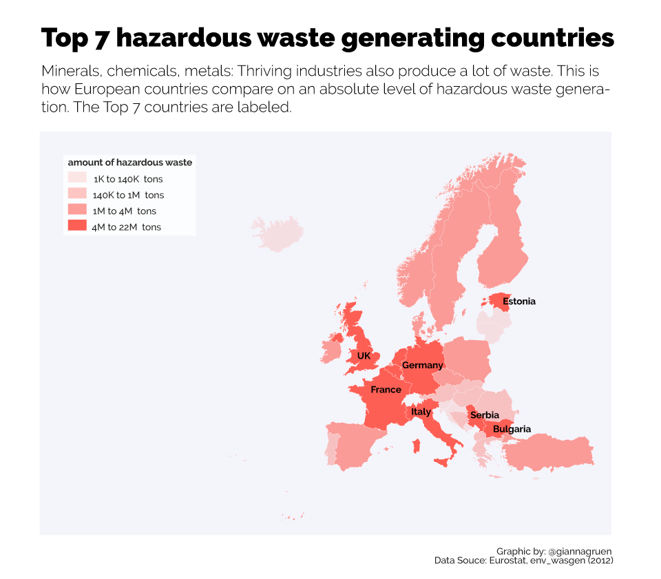

Who produces most waste? And how does waste generation develop over time? This line graph timeseries has the answers:

But not all waste is necessarily bad -- as long as countries manage to recycle their waste. Turns out, whereas paper has fairly good recycling rates between 75 and 100 percent, plastic has the worst recycling rates (between 25 and 50%)

Looking beyond recycable waste, there's also non-recycable hazardous waste generated mainly by the industrial sector. Looking at total amount of hazardous waste produced, there are smaller countries among the top7 that might not have a strong economy, but still lead in waste generation.

If this was a story to publish in a media outlet, I would further investigate which countries are role models in recycling and what their secret for it is and also how hazardous waste is dealt with with regard to environmental aspects.
