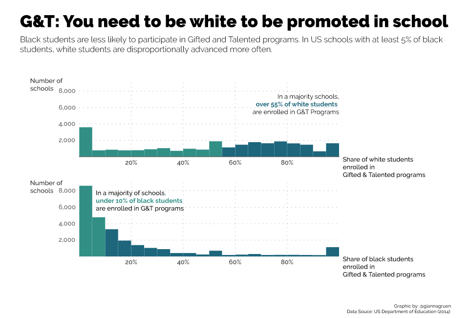
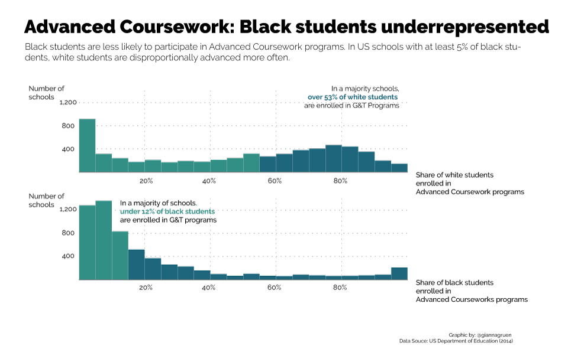

Black Lives Matter started as a movement against police violence towards black people in the US. However by now the movement broadened to fight against discrimination against black in general.

One of their aims: Receive financial reparations for the racial bias inherent in the educational system.

On their website they present several claims how black students are disadvantaged, but there's no visual or statistical evidence. So it was Georgia's idea to change that.

Looking at the extracurricular support students can get - in form of being supported in gifted and talented programs for example - data shows how highly unlikely it is for black school kids to receive the same support as their white classmates.

Now, Gifted and Talented programs are a very special thing to look at -- in theory, this applies only to a small share of students in general.

That's why additionally I took a look at Advanced Coursework enrollment. Advanced coursework allows students to earn college credit already in high school. This allows them to take less courses in college and thereby save both, time and money. However this seems to be a program, mainly white students can benefit from:

But it is not only that black students are not supported. Moreover, already in school there seems to be made a link between race and criminalization. Data shows how black student population is twice as high in schools that have at least one law enforcement officer, compared to schools that don't have one.

Sadly, none of this is new. There are even government essays on this topic ([US Department of Education](https://nces.ed.gov/fastfacts/display.asp?id=72) and [US Census Bureau](https://www.census.gov/content/dam/Census/library/publications/2016/demo/p20-578.pdf)) -- proving that the people in charge are well aware of the problem, but somehow seem to fail in changing something about it.
