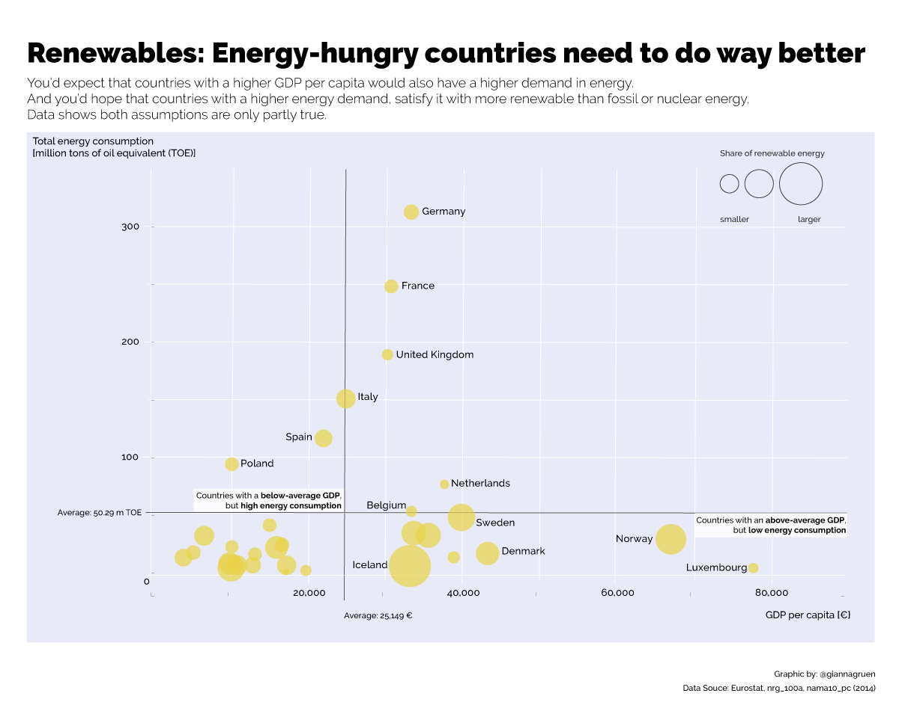
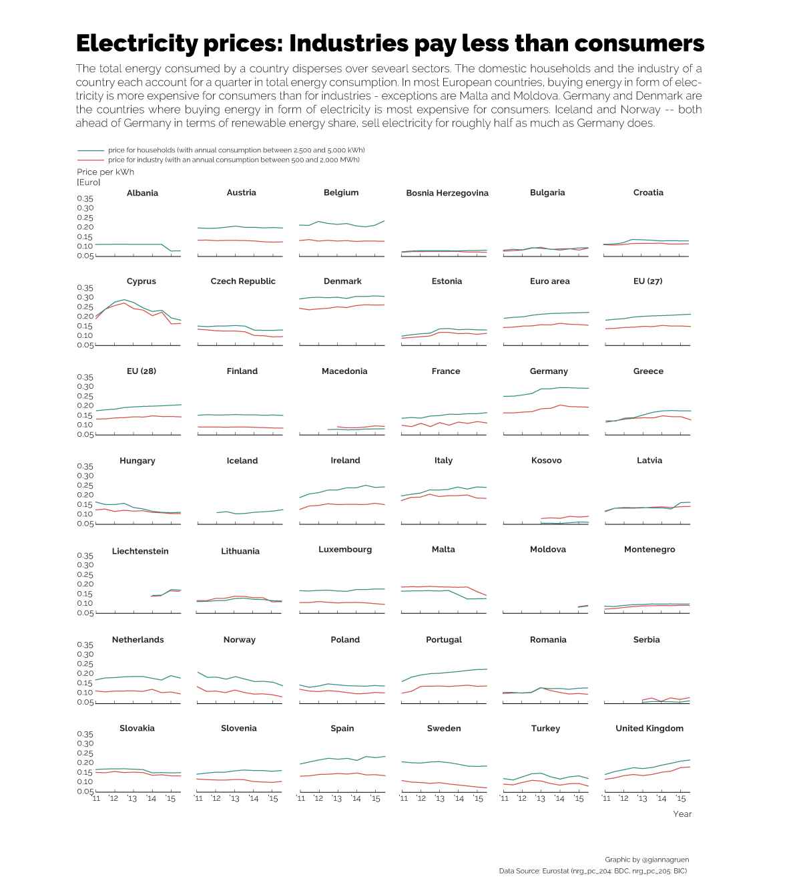

---
  title: "Energy transition in Europe: Which country is the real role model?"
  summary: "Exchange fossil energy with green energy -- that's the aim of Europe's energy transition. Germany is seen as a blueprint, maybe not legitimately though."
---

Cutting energy demand, shut down all nuclear reactors and most important: satisfy the energy demand increasingly with renewable energy -- that's the core of the energy transition underway in Europe.

And Germany is said to be the role model for it.

In absolute numbers, it consumes and produces the largest amount of renewable energy.

Looking at relative figures however shifts the image:

Probably, it is more difficult to have a great share of renewable energy, if the overall energy consumption is high and a country is defined by a big, energy-consuming industry.

To check whether there might be exceptions from this assumption, the renewable shares were put into more context: the overall energy consumption and GDP per capita:

If you break down overall energy consumption by sector, industry and households each account for quarter of overall consumption.

Thus, if a country like Germany wants to cut its energy demand, it’s not only households that need to save energy, but also the industrial sector. One measure to trigger a change is to alter the price you have to pay per kilowatthour (kWh). However energy is usually cheaper for industries than for households.

And the alleged role model Germany even increased prices slightly, whereas Norwegian consumers pay roughly half as much -- with a trend of further falling prices.

These graphics are a starting point for an article, I'll be writing for [*Der Kontext*](http://wwww.derkontext.com) to figure why Germany might still be a role model (despite the facts outlined above) and what European countries can learn from renewable-energy-heroes like Norway, Sweden and Iceland.
