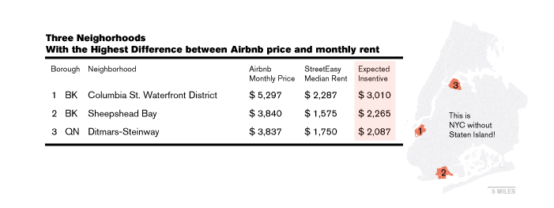

Columbia Street Waterfront District, Sheepshead Bay and DItmars-Steinway are top three NYC neighborhoods with the widest gap between Airbnb price and rent.

Columbia Street Waterfront District has a $3,010 differential between Airbnb income and median asking rent. The amount is almost 1.5 times more than long-term apartment can make. The other two neighborhoods make more than $2,000 by listing their place at the home sharing platform. Such financial incentives can be a strong force of losing housing stocks in those neighborhoods in near future.

Interestingly, all of those three neighborhoods happen to be located near water. Maybe this implies that water feature valued differently to tourists than to residents in NYC. 
