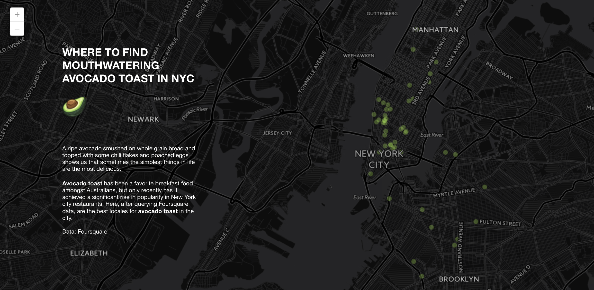

[Click here for the map!](https://columbialibraries.carto.com/u/juneseo/viz/15e46f14-501d-11e6-9203-0ef24382571b/public_map)

A ripe avocado smushed on whole grain bread and topped with some chili flakes and poached eggs shows us that sometimes the simplest things in life are the most delicious.

Avocado toast has been a favorite breakfast food amongst Australians, but only recently has it achieved popularity in New York City restaurants. Here, after querying Foursquare data, are the places for the most mouthwatering avocado toast in the city.
