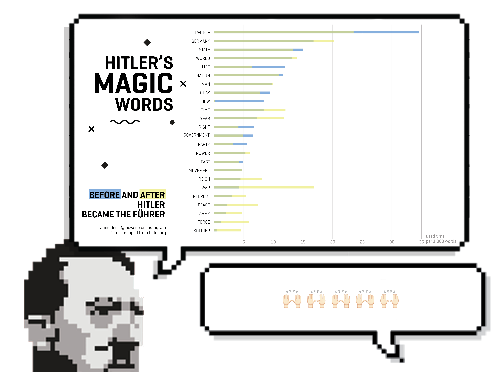

Hitler was known for his ability to control people's emotions with his oratory. I tried to look at most frequently used words and changes in his selection of words as he becomes the führer of the Nazi Germany. Two most frequently used words for both era are 'People' and 'Germany'. Before he became the führer, he used the word 'Jew' quite a bit, but interestingly, he barely talked about 'Jew' after he takes over complete power. Instead, the use of the word 'War' increased dramatically.

Finding1. 'People' and 'Germany' were the most frequently used words in both era. But other words such as 'State', 'Nation', and 'Reich' fall into same category as 'Germany'. I could figure Hitler repeated these words to convey his nationalistic idea to listeners.
Finding2. Before he became an absolute power, he used the word 'Jew' quite a bit, 8 words per every 1,000 words. However, he barely talked about 'Jew' after he takes over power. I feel like he used 'Jew' card to blame every hardship that Germany was facing and then after he became the führer, he didn't need to look for consensus to get rid of those people.
Finding3. The use of the word 'War' increased dramatically. And the use of other war-related words, such as 'Interest', 'Peace', 'Army', 'Force', and 'Soldier' also increased. I could imagine that when he took control of Germany, he tried to divert people's attention to external affairs from national affairs, blaming everything on unfair treaties they made after World War I and justifying wars to nullify such treaties.
