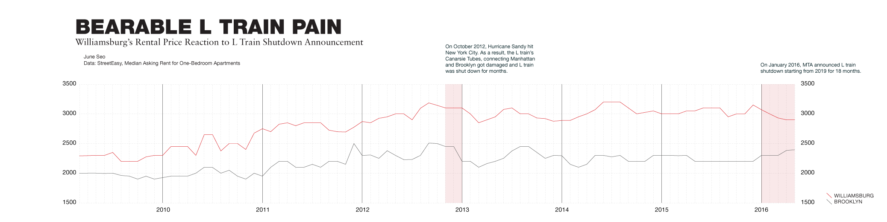

This January, MTA announced that L train will be closed for 18 months starting from 2019. Many housing experts anticipated it would dramatically decrease rents in Williamsburg. In this neighborhood, 75% of the population rent out their apartment and commuters to Manhattan rely heavily on L train.

In 2012, L train have been damaged from Hurricane Sandy and people have been suffering from lots of delays. The shut-down was to repair L train's Canarsie Tubes connecting Manhattan and Brooklyn.

Williamsburg's rental price reaction to L train shut-down was not so dramatic as expert anticipated according to StreetEasy data. Median rent for entire Brooklyn and Williamsburg have been moving similar direction in general over past six years. After the announcement was made in 2016, rent decreased slightly while that of entire Brooklyn rose. Since actual repair starts in far future, it is necessary to keep eye on it to capture meaningful market reaction.
