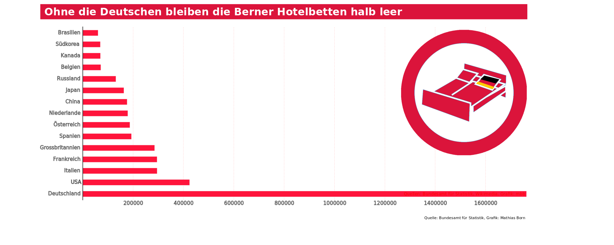
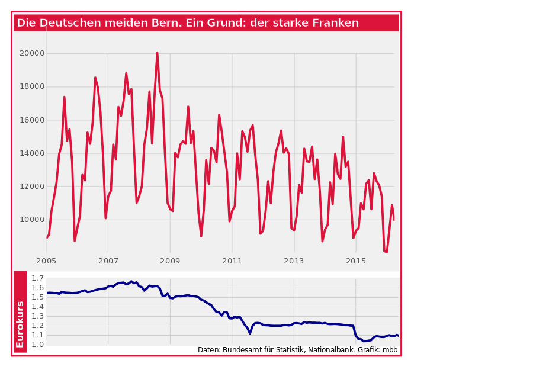

Swiss are first. The second important group of guests for Bern's hotels are Germans. The number of nights they are spending in Bern declines, though.

The most obvious reason for this is the strong Swiss Franc -- or the weak Euro. 

