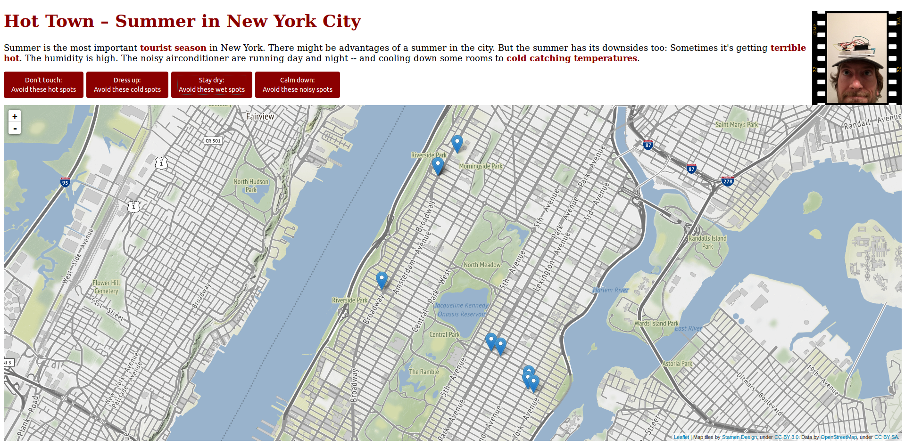

I used an Arduino for mesuring the temperature, humidity and noise. You will find the sketch in the directory tourilogger_wlan. The result is an interactive map: [tourimap.html](tourimap.html). 

There are some exports here: 

