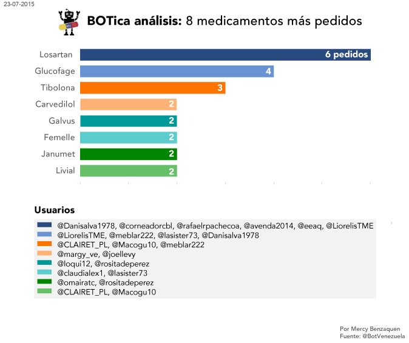

BOTica is a Twitter BOT that I created to help with the health crisis in Venezuela. It is a platform where people can donate and ask for medicines.
By July 23rd, BOTica has received 81 requests for medicines. With this chart I chose the 8 most wanted medicines. 
I posted this chart in BOTica's account to encourage people to donate medicines and help non-profit organization identify the medicines that are needed the most.

