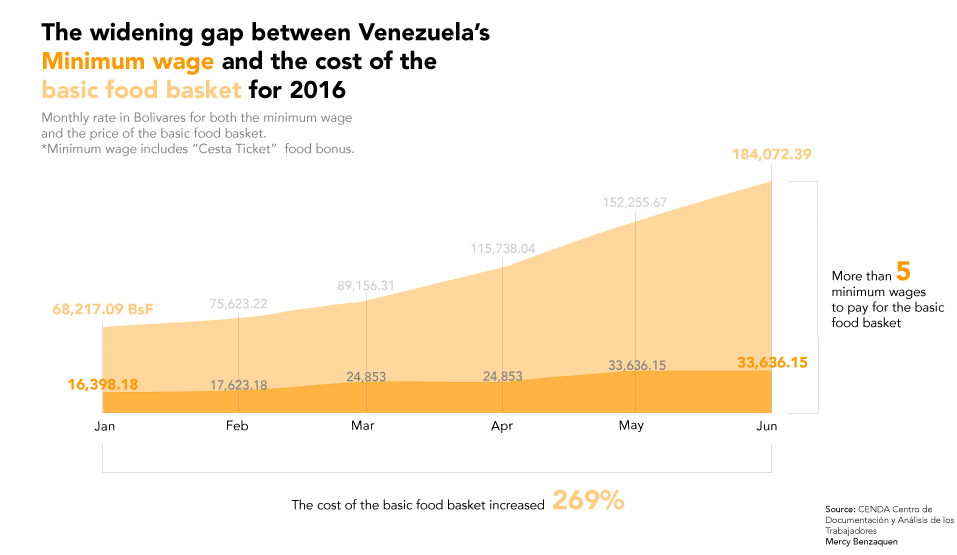

For the first chart I compared the minimum wage with the cost of the basic food basket. Both increased in the 6-months timeframe but the cost of the basic food basket increases at a much higher rate and magnitude.

For the second chart, I go into details. I plot the prices for some products of the basic basket and compare their prices for the year 2015 and for this year. The difference is shocking.

