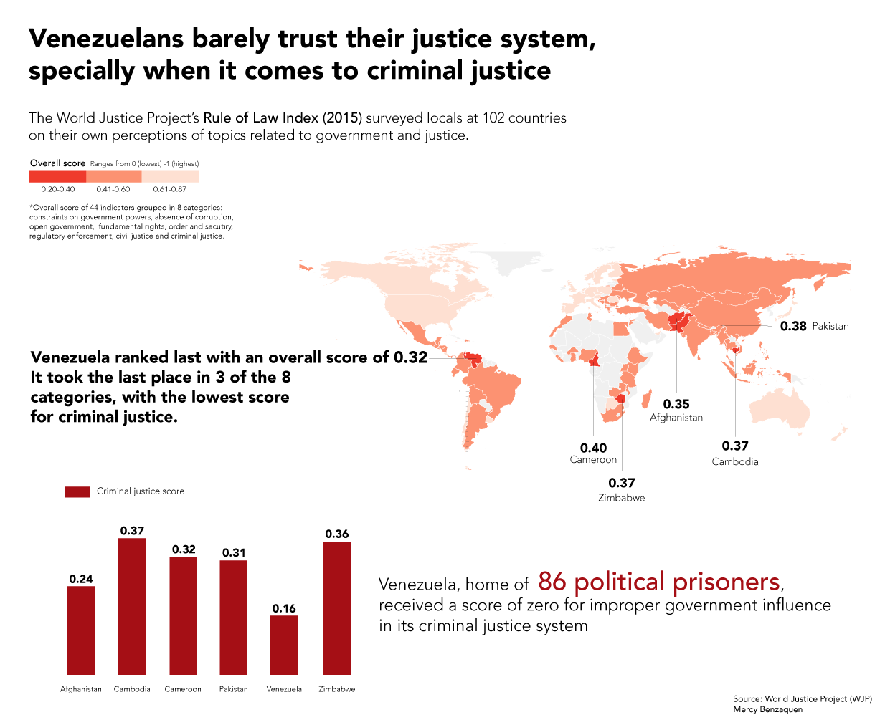

The first chart gives information on the number of political prisoners per year since the year 2002. It also provides background information to help the reader understand the increase in political arrests.

The second chart compares Venezuela with 101 other countries in how their citizens perceive the Rule of Law. It also shows how Venezuela does compared two the 5 lowest ranking countries in the criminal justice category.

