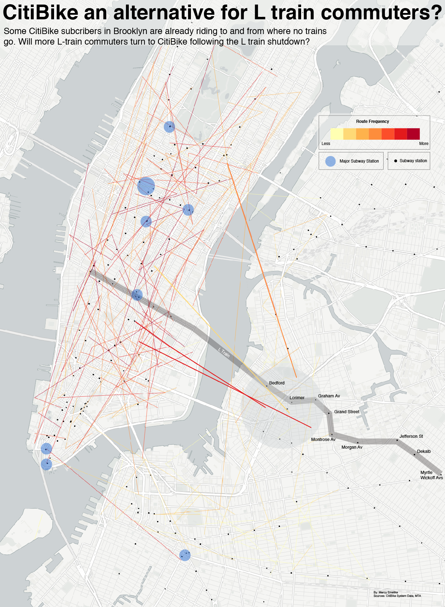

---

title: "CitiBike an alternative for L train commuters?"
  
summary: "The most popular CitiBike ride routes between BK and Manhattan start where trains are hard to access in BK. Will commuters along the L train join the ranks of those who bike to work instead of treking to the nearest MTA station"

author: Mercy Emelike  

---

