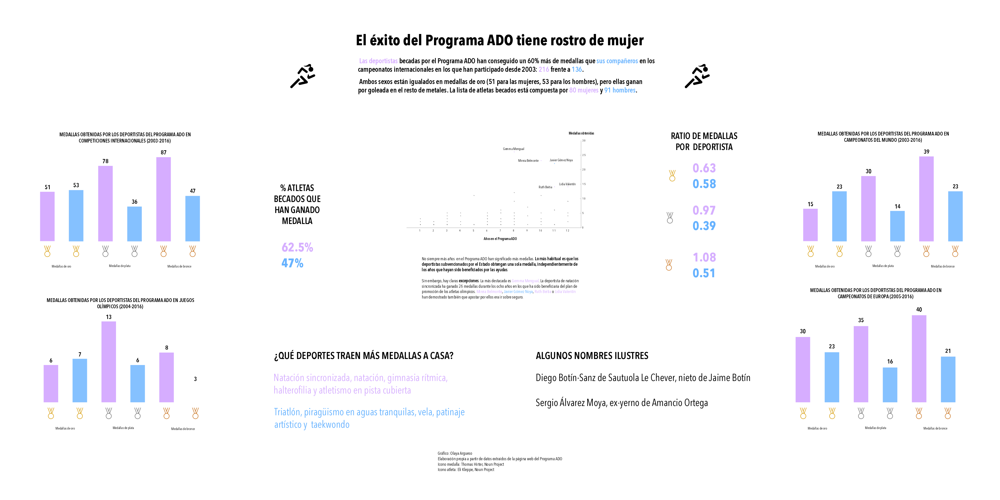

This poster contains several charts that reveal some interesting points:

  * female athletes win 60% more medals in international competitions than their male fellows
  * they won two thirds of the more than 350 medals conquered by Spain in the Olympic Games, and world and european championships.
  * the ratio of medals per athlete per gender is almost even for the highest honor, the gold medal, but is almost double for women in the rest of metals.
  * more years receiving state backing don't necessarily mean more wins - the most common result is just one medal per athlete, no matter which gender -, but there are a few outstanding names that represent the success of this program. Most of them are female.

