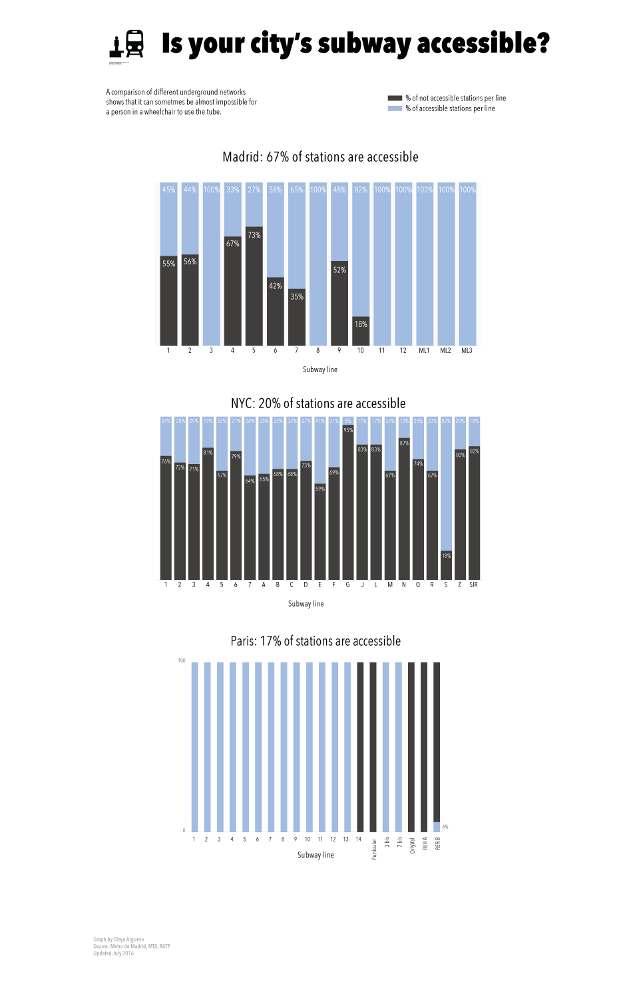

After analysing data from Madrid, Paris and NYC's subway networks, this graph shows the degree of accessibility of the subway networks of these three cities.

As you can see, Paris and NYC are far behind Madrid. A reason for that may be that Madrid's network is very new (at least 45% of its stations have been built or revamped in the 2000's).

