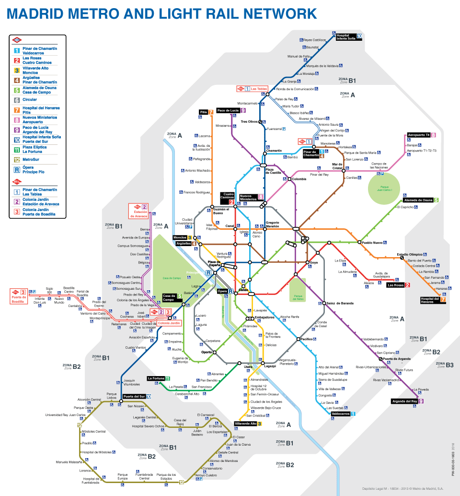
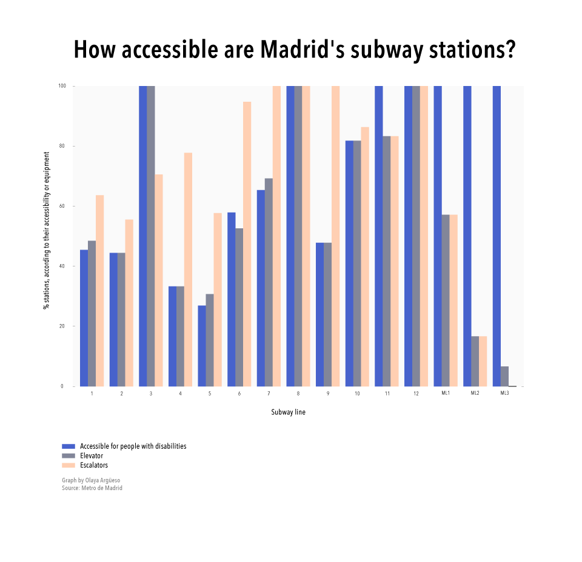

Inspired by own experience as a passenger, and by [Matthew Ahn's map of accessible subway stations in NYC](https://www.dnainfo.com/new-york/20150608/bushwick/map-subway-map-showing-only-wheelchair-accessible-stations), I decided to check if - as I suspected - Madrid's subway network was more friendly for people with disabilities.

According to Ahn's account, **less than 20% of NYC's underground stations can be accessed** if using a wheelchair (or trying to move around the city with a baby in a stroller). That is, roughly 100 out of 490.

**In Madrid, two thirds of the 275 stations (67%) are fully accessible**. Besides, more than half the stations (57%) are equipped with an elevator and a similar proportion do have both escalators and elevator.

One of the main reasons for the different degree of accessibility of these two subway networks could be their age. While most of NYC's lines were built before the 1970's, **at least 45% of Madrid's underground stops have opened or have been fully revamped during the 2000's**.

However, there are still 34 stations (12%) with neither elevator nor escalators. Eleven of these belong to Line 1, the oldest, which is undergoing major construction works this summer. Nonetheless, as Metro de Madrid press office has explained to me, this repairs do not include revamping the stations. That is, there will be not improvement to make them more easily accessible for people with mobility problems. It is worth noting that Line 1 is the second most popular in all Metro de Madrid's network: more than 85 million passengers used it in 2015, many of them being tourists, since this line passes by many of the city's major sightseeings and, connects the two main railway stations. Besides, more than half of the stations of the most used line (6 Circular, almost 95 million passengers last year) are not accessible.

This map shows only those stations in Madrid's subway network that are fully accessible:

In this bar chart, the percentage of stations per line, according to their degree of accessibility:

