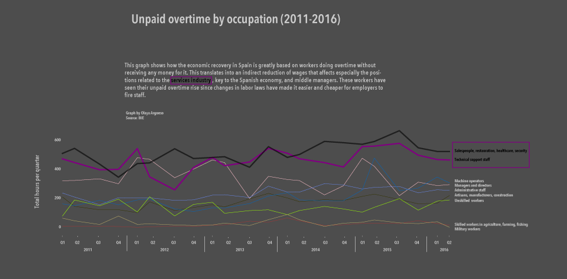

The first graph  visualizes the average quarterly hours of unpaid overtime broken down by gender. Two trends become clear: the peak times of this kind of work are cyclical, and men do more non-rewarded extra hours - one possible reason for this is that women have half part-time jobs more frequently than men.

The second graph splits the quarterly overtime by occupation. I have excluded a category that included almost all the possible jobs and caused therefore a lot noise while not being representative. The resulting chart shows how the unpaid overtime has grown along with the so-called economic recovery - especially in the services sector, key to the Spanish economy -, raising questions about how equal that growth has been.
