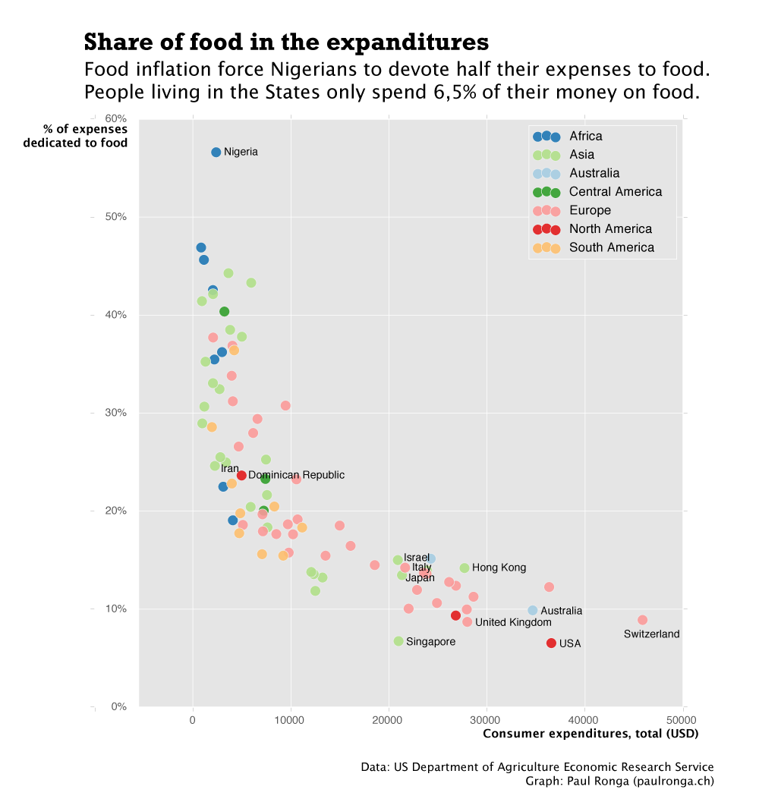
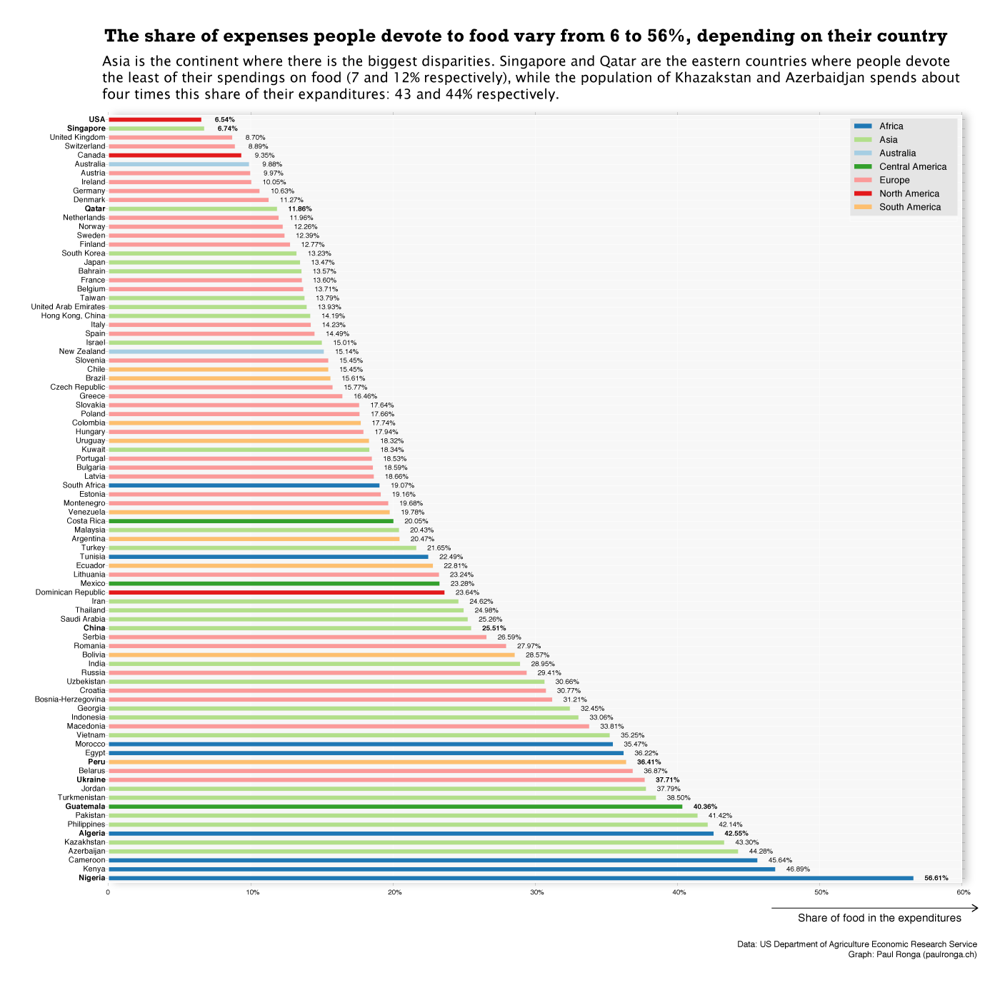

Asia is the continent where there is the biggest disparities. Singapore and Qatar are the eastern countries where people devote the least of their spendings on food (7 and 12% respectively), while the population of Khazakstan and Azerbaidjan spends about four times this share of their expanditures: 43 and 44% respectively.

