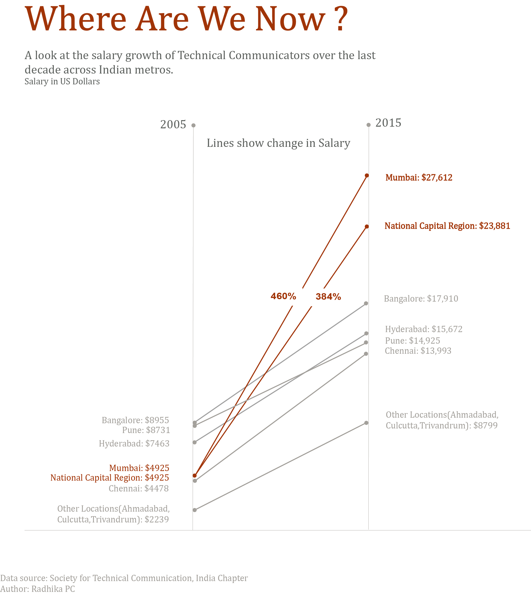

## Technical Communicators' Salary: Percent Growth 2005-2015 ##

This is my attempt to analyze the average salary growth of Technical Communicators over the past decade in major Indian metros: Bangalore, Pune, Hyderabad, Chennai, and National Capital Region -NCR (Delhi, Gurgaon, Noida, Faridabad). It's to my surprise, Mumbai topped the list with close to 500% increase over the past decade, whereas in Bangalore it's only 100%. National Capital Region came second with 384% growth.

It's evident that supply and demand played a central role in this drastic change. Scarcity of seasoned Technical Communicators and proliferation of IT firms in Mumbai and NCR have escalated the competition for the best talent. In Bangalore and Pune, the demand and supply functions have reached an equilibrium point so the war for the skillset isn't fierce. The startup boom that India has witnessed in the recent past has also contributed to this disparity in salary growth. According to a study conducted by The Associated Chambers of Commerce of India (ASSOCHAM) NCR and Mumbai follows Bangalore to host the largest share of technology driven start-ups.  However, because Bangalore already has the highest concentration of IT talents, the companies need not compete for tech talents as much as other metros do.

Here are some news that clarify how Mumbai and NCR has lured investors  away from Bangalore and grown as IT hubs:
http://www.techrepublic.com/blog/asian-technology/mumbai-lures-product-startups-away-from-it-services-hub-bangalore/
http://qz.com/720123/bengaluru-is-not-the-hottest-startup-destination-in-india-any-more/

