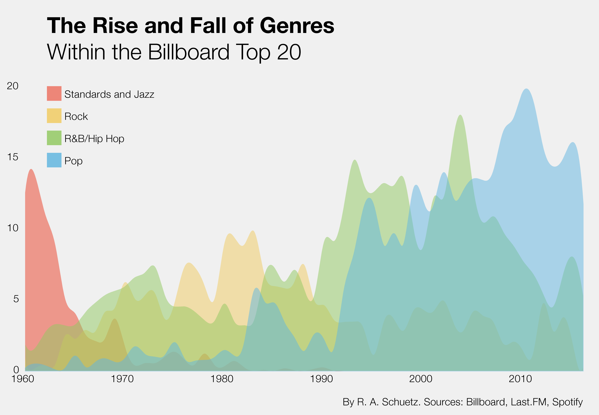
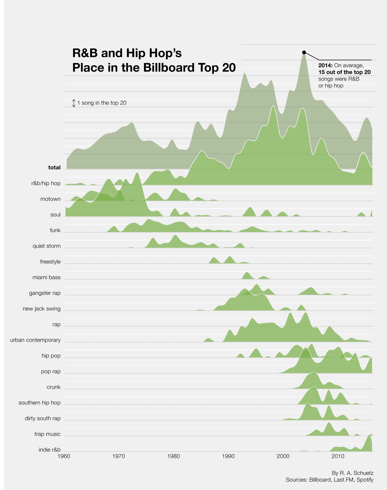

Here's how many of the top 20 spots these genres showed up every year on average:

Note: If a song could be considered part of two genres, such as Maroon 5's "Harder to Breathe" (pop and rock), it shows up here as both.

And just as some songs are crossovers between genres, some songs fall into more than on subgenre. Take Drake for example: Pop rap? Indie r&b? Spotify argues he's both, and so he appears in both graphs here.

However, in the graph above, even though "Hotline Bling" may be two flavors of r&b/hip hop, it's only counted once for the overall category.

