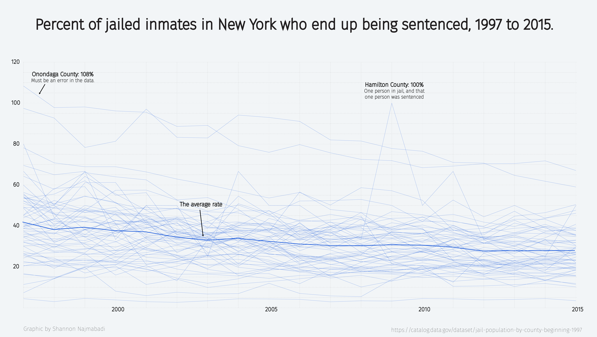
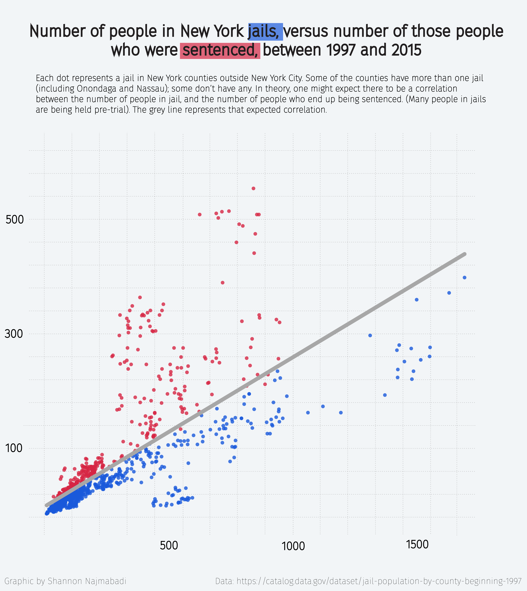
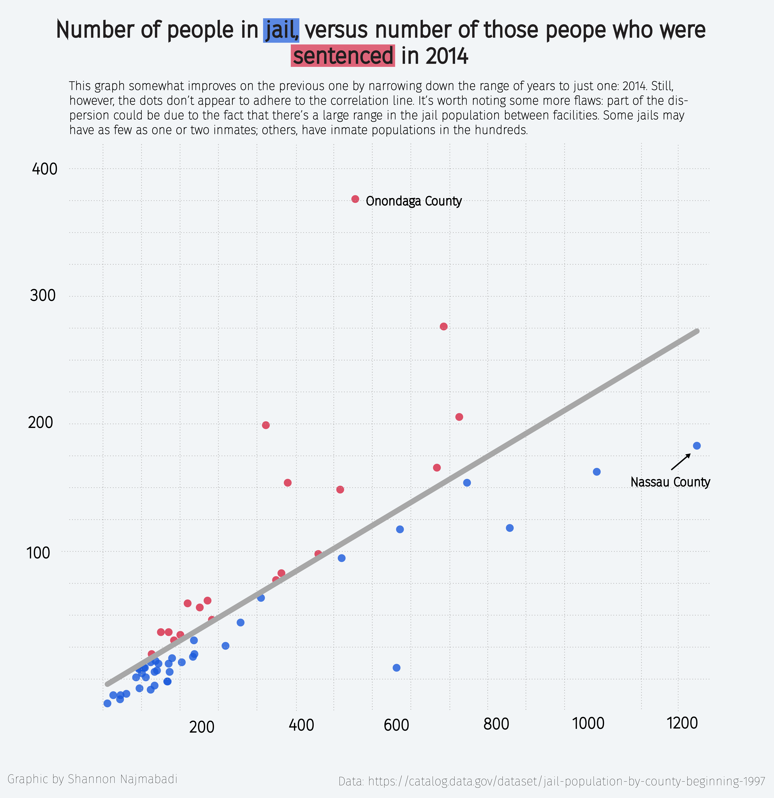

Data from:
https://data.ny.gov/Public-Safety/Inmates-Under-Custody-Beginning-2008/55zc-sp6m
https://catalog.data.gov/dataset/jail-population-by-county-beginning-1997

This series expands on an earlier one exploring New York's jail population. This project looks at how many people there are in jail versus how many are sentenced, with particular focus on change over time and differences between counties.
